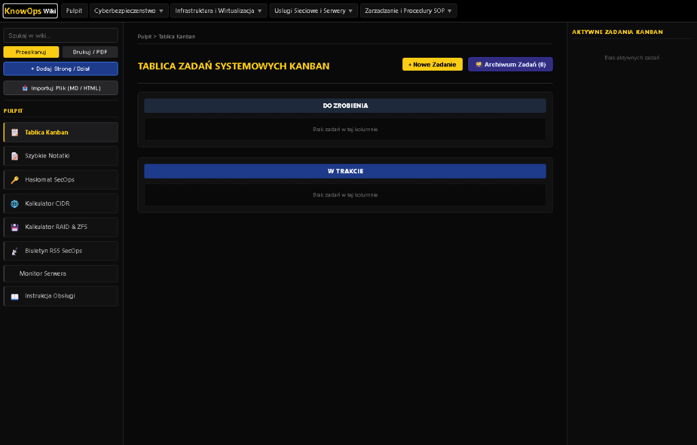

# KnowOps Wiki Application

Nowoczesny, lekki, utwardzony portal wiedzy **KnowOps** oraz centrum operacyjne zarządzania zadaniami systemowymi dla inżynierów systemowych, administratorów sieci i ekspertów CyberSec.



---

## Status projektu i cel (wersja beta)

> [!NOTE]
> **Aplikacja znajduje się w fazie Beta** — projekt jest aktywnie rozwijany, testowany i sukcesywnie ulepszany o nowe funkcjonalności. KnowOpsWiki powstało jako własne, samowystarczalne i utwardzone bezpieczeństwem (SecOps) **zastępstwo dla komercyjnego środowiska Notion**, zapewniając 100% kontroli nad prywatnymi danymi, szybkie lokalne działanie w kontenerach Docker oraz brak zależności od zewnętrznych usług chmurowych.

---

## Model użytkowania i architektura dostępu (single-user)

> [!IMPORTANT]
> **Model single-user:** 
> Na obecnym etapie rozważania architektoniczne i funkcjonalne zakładają, że aplikacja jest przeznaczona do **użytku osobistego dla jednego inżyniera / administratora** (Single-User Environment). System nie zawiera wbudowanego modułu wieloużytkownikowego z podziałem uprawnień (RBAC / multi-account).

**Zalecany model wdrożenia i bezpieczny dostęp:**
- **Self-Hosted w sieci lokalnej (LAN / VPN):** Uruchomienie na własnym serwerze domowym lub firmowym z dostępem z poziomu sieci lokalnej bądź za pośrednictwem szyfrowanego tunelu VPN (np. WireGuard, Tailscale).
- **Publikacja w sieci publicznej (Cloudflare Tunnel & Access):** W przypadku wystawiania portalu na zewnątrz zaleca się zabezpieczenie dostępu poprzez **Cloudflare Tunnel (`cloudflared`)** z podłączoną warstwą uwierzytelniania **Cloudflare Zero Trust / Access** (np. logowanie One-Time Pin / Google / OAuth). Hasło zdefiniowane w `.env` (`ADMIN_PASSWORD`) służy do zabezpieczenia tokenów sesyjnych API.

---

## Powstanie projektu i autorstwo

Projekt oraz kod źródłowy aplikacji zostały stworzone i zaimplementowane przez zaawansowanego agenta sztucznej inteligencji (AI) pod bezpośrednim nadzorem technologicznym, kierownictwem architektonicznym i według wytycznych właściciela projektu.

---

## Architektura i trwałość danych (Docker volumes)

Aplikacja została zaprojektowana w oparciu o architekturę izolacji i trwałości danych. Zmienne dane użytkownika są montowane jako woluminy z dysku hosta w `docker-compose.yml`:

- **`./docs`** -> Montowany pod `/usr/share/nginx/html/docs` (Nginx) oraz `/app/docs` (API). Przechowuje strukturę i pliki dokumentacji Markdown. Środowisko automatycznie inicjalizuje ten katalog z szablonu `./docs.example` przy pierwszym uruchomieniu, a właściwy plik `./docs` jest wykluczony w `.gitignore` dla ochrony produkcyjnej dokumentacji.
- **`./data`** -> Montowany pod `/app/data`. Przechowuje bazy zadań Kanban (`kanban_data.json`), notatki (`quick_notes.json`) oraz szablony zadań (`task_templates.json`).
- **`./public/images`** -> Montowany pod `/usr/share/nginx/html/public/images` oraz `/app/public/images`. Przechowuje przesłane i wklejone obrazy.

Dzięki tej strukturze rekompilacja obrazów Docker (`docker compose up -d --build`) oraz restarty kontenerów nigdy nie naruszają ani nie usuwają treści wprowadzonych przez użytkownika.

---

## Przykładowa struktura katalogów i migracja treści

Projekt udostępnia domyślny, czysty i wolny od praw autorskich szkielet struktury katalogów oraz przykładowych plików szablonowych w katalogu `docs/`. Struktura ta służy do natychmiastowej weryfikacji aplikacji oraz jako baza startowa do budowania własnej bazy wiedzy.

> [!NOTE]
> **Elastyczna migracja treści:** 
> Do katalogu `docs/` można swobodnie migrować i kopiować własne pliki `.md` oraz katalogi pochodzące z innych systemów lub notatek (o ile nie naruszają one niczyich praw autorskich ani poufności). Serwer po uruchomieniu automatycznie odczytuje pełną strukturę katalogów i buduje dynamiczne drzewo nawigacyjne.

Przykładowe drzewo struktury szkieletowej w `docs/`:

```text
docs/
├── 01_Cyberbezpieczenstwo/
│   ├── 01_SOC_i_Incident_Response/
│   │   ├── 01_Procedura_Obslugi_Incydentow.md
│   │   └── 02_Analiza_Logow_i_SIEM.md
│   └── 02_Hardening_Systemowy/
│       ├── 01_Hardening_Serwerow_Linux.md
│       └── 02_Hardening_Windows_Active_Directory.md
├── 02_Infrastruktura_i_Wirtualizacja/
│   ├── 01_VMware_vSphere/
│   │   ├── 01_Procedury_Backupu_ESXi.md
│   │   └── 02_Konfiguracja_Klastrow_HA.md
│   └── 02_Docker_i_Konteneryzacja/
│       ├── 01_Dobre_Praktyki_Dockerfile.md
│       └── 02_Zarzadzanie_Wolumenami.md
├── 03_Uslugi_Sieciowe_i_Serwery/
│   ├── 01_Nginx_i_Reverse_Proxy/
│   │   ├── 01_Konfiguracja_Certyfikatow_SSL.md
│   │   └── 02_Limitowanie_Zadan_Rate_Limiting.md
│   └── 02_Active_Directory_i_DNS/
│       ├── 01_Polityki_GPO_Security.md
│       └── 02_Struktura_Jednostek_OU.md
└── 04_Zarzadzanie_i_Procedury_SOP/
    └── 01_Procedury_Operacyjne/
        ├── 01_Checklista_Przegladu_Tygodniowego.md
        └── 02_Procedura_Aktualizacji_Serwerow.md
```

---

## Główne funkcjonalności

1. **Wbudowany edytor Markdown z podglądem na żywo:**
   - Pełne wsparcie dla formatowania tekstu, tabel, bloków kodu i składni Markdown.
   - Pasek narzędzi z szybkimi wzorcami oraz automatyczną walidacją i zapisem.

2. **Diagramy i schematy wektorowe (Mermaid.js):**
   - Automatyczne renderowanie schematów blokowych, wykresów Gantta, diagramów sekwencji, klas, stanów oraz struktur Active Directory z bloków `mermaid`.

3. **Zarządzanie dokumentacją i nawigacją:**
   - **Przenoszenie myszką (Drag & Drop):** Przeciąganie dokumentów `.md` bezpośrednio w drzewie nawigacyjnym lewego menu na docelowe katalogi.
   - **Obsługa wielopoziomowych podkatalogów:** Wsparcie dla dowolnie zagnieżdżonych struktur podkatalogów (1., 2., 3., N-ty poziom).
   - **Dedykowany tryb druku / PDF:** Czyste generowanie dokumentów do druku lub plików PDF bez paneli nawigacyjnych.

4. **Wgrywanie mediów i grafiki (`Ctrl + V` / Drop):**
   - Bezpośrednie wklejanie zrzutów ekranu ze schowka oraz przeciąganie grafik na pole edytora z automatyczną weryfikacją rozszerzeń i limitu rozmiaru (5 MB).

5. **Tablica Kanban i szablony zadań:**
   - Zarządzanie zadaniami z podpodziałem na checklisty, priorytetyzację (High -> Medium -> Low), automatyczną archiwizacją oraz bazą szablonów wielorazowych zadań administracyjnych.

6. **Wbudowane narzędzia administracyjne:**
   - Generator bezpiecznych haseł i fraz passphrase.
   - Kalkulator podsieci IP (CIDR) oraz kalkulator macierzy RAID.
   - Monitor zasobów i statusu serwera hosta (CPU, RAM, Dysk, Uptime na którym uruchomiony jest kontener) oraz czytnik biuletynów bezpieczeństwa RSS.

---

## Bezpieczeństwo i hardening (SecOps)

Aplikacja posiada zaimplementowane producenckie mechanizmy utwardzania i bezpieczeństwa:

- **Nieuprzywilejowany kontener (`USER node` - UID 1000):** Kontener API Node.js działa na wyizolowanym koncie nieuprzywilejowanym z UID 1000, dopasowanym do uprawnień właściciela na serwerze Linux.
- **Dynamiczny Rate-Limiter API:** Ochrona przed atakami typu Brute-Force na logowanie (max 5 prób / 60s) oraz obostrzenie operacji modyfikacji danych (max 30 żądań POST / 60s per IP).
- **Ochrona przed Path Traversal i SSRF:** Rygorystyczna walidacja ścieżek `DOCS_DIR` oraz blokada zapytań skrapera do podsieci prywatnych (`127.0.0.1`, `localhost`, `192.168.x.x`, `10.x.x.x`).
- **Autoryzacja i nagłówki HTTP:** Tokeny z 24h okresem ważności, limity czasu procesów potomnych oraz nagłówki `Content-Security-Policy` w serwerze Nginx.
- **Weryfikacja zdrowia (Healthcheck):** Kontenery wyposażone w automatyczny monitoring HTTP healthcheck.

---

## Szybkie uruchomienie (krok po kroku)

### 1. Sklonowanie repozytorium z GitHub
Do poprawnego uruchomienia środowiska wymagany jest pełny kod z repozytorium:

```bash
git clone https://github.com/KamilJanczyk/KnowOpsWiki.git
cd KnowOpsWiki
```

### 2. Przygotowanie pliku środowiskowego
Skopiuj plik wzorcowy `.env.example` do pliku `.env` i ustaw własne bezpieczne hasło administratora:

```bash
cp .env.example .env
```

Przykładowa treść pliku `.env`:
```env
API_PORT=9000
ADMIN_PASSWORD=TwojeBezpieczneHaslo123!
WIKI_PORT=8085
```

### 3. Uruchomienie środowiska (Docker Compose)

```bash
docker compose up -d --build
```

Aplikacja będzie dostępna pod adresem: `http://localhost:8085` (lub port skonfigurowany w `WIKI_PORT`).
